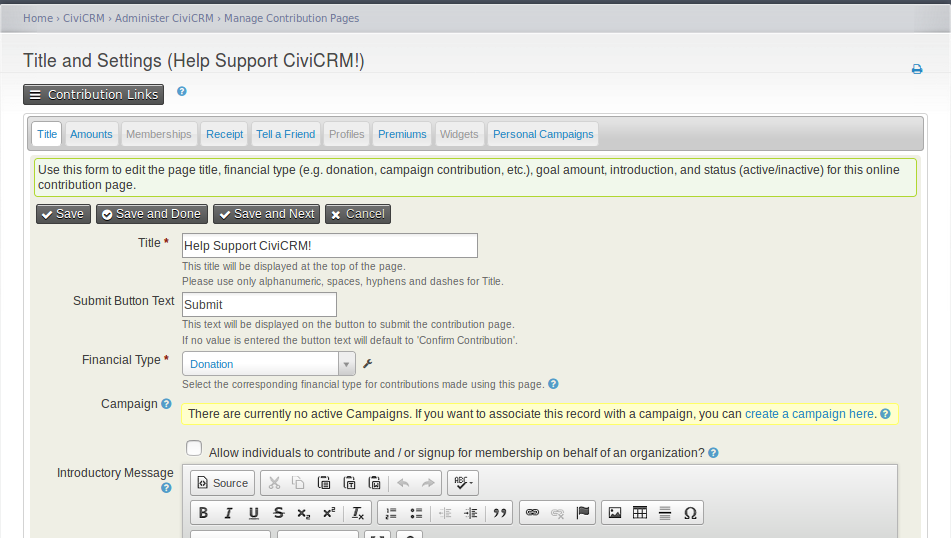
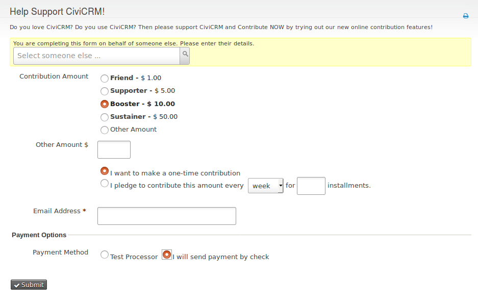

This Extension:
--------------

The submit button text on CiviCRM contribution pages defaults to "Confirm Contribution". This extension adds a field to the "Title and Settings" tab for contribution pages to allow admin users to change the submit button text to say whatever they want.

Common examples of alternate text for the button: "Submit", "Next", "Join" etc.
